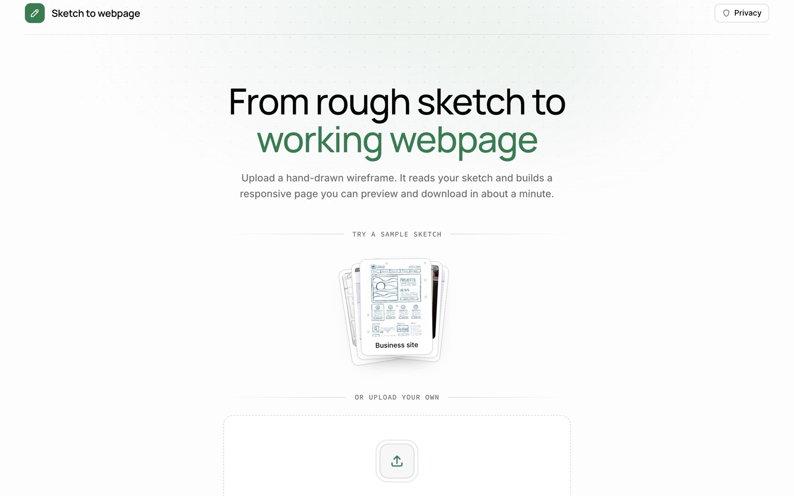
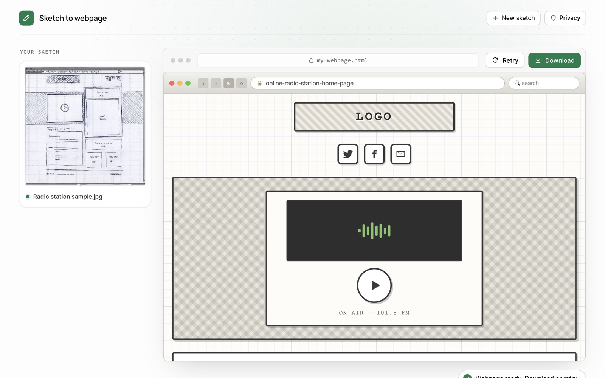
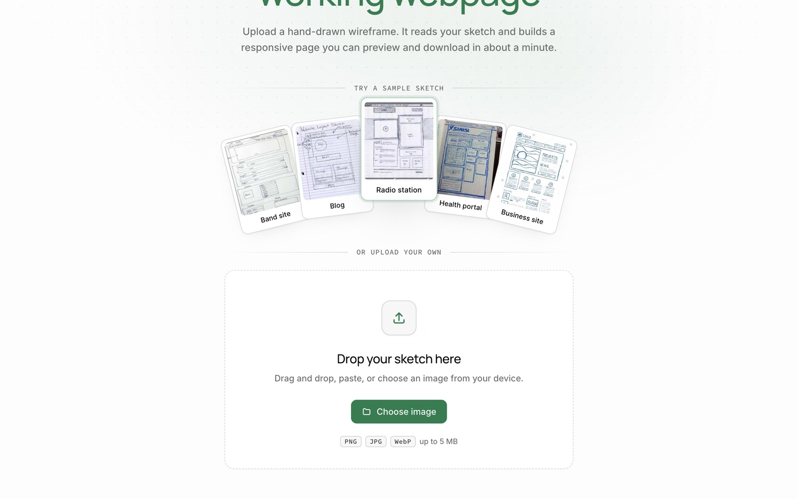
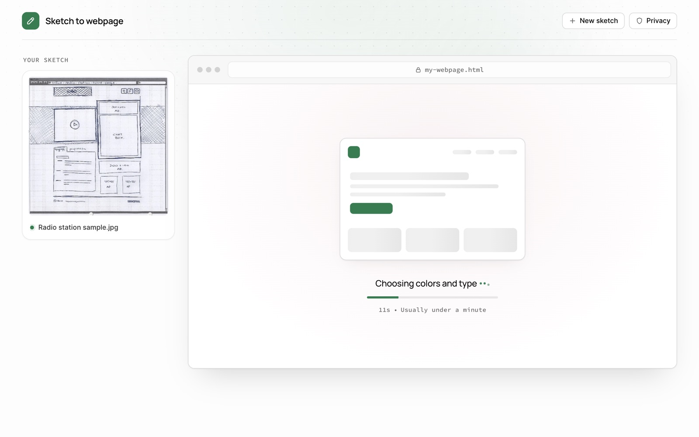
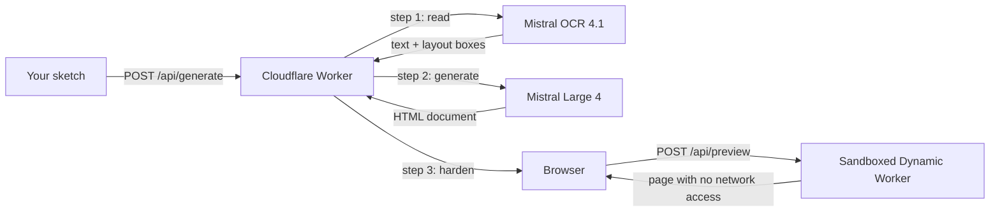

# Sketch to webpage

Turn a hand-drawn wireframe into a working, responsive webpage in a minute or two.
Built with **Mistral OCR 4.1** and **Mistral Large 4** on **Cloudflare Workers**.



## What it is

Draw a webpage on paper, take a photo, and drop it in. The app reads your handwriting, understands the layout, and writes a single self-contained HTML page that you can preview live and download.



| No sketch? Draw a sample from the deck | Live progress while it builds |
| --- | --- |
|  |  |

## How it works



1. **Read.** Mistral OCR 4.1 extracts the handwritten text and where each block sits on the page.
2. **Generate.** Mistral Large 4 looks at the sketch itself, using the OCR only as supporting evidence, and returns one HTML file with inline CSS and JavaScript.
3. **Harden.** The Worker removes `<meta http-equiv>` and `<base>` tags and adds a strict Content Security Policy.
4. **Preview.** The page is served from a [Dynamic Worker](https://developers.cloudflare.com/workers/runtime-apis/bindings/worker-loader/) with no outbound network, inside a sandboxed iframe.

**Retry** sends the previous page back so the model corrects it instead of starting over. Images and pages stay in memory; nothing is stored.

```
├── src/index.ts        routes, validation, rate limit
├── src/generation.ts   Mistral OCR and Large 4 calls
├── src/preview.ts      HTML hardening and sandboxed preview
├── public/             the UI, sample sketches and fonts
└── tests/              API tests with Mistral mocked
```

## Run it locally

You need **Node.js 22+** and a **Mistral API key** ([create one](https://docs.mistral.ai/admin/identity-access/api-keys)). No Cloudflare account is needed to run it locally.

```bash
git clone https://github.com/megaconfidence/sketch-to-webpage.git
cd sketch-to-webpage
npm install
cp .env.example .env   # paste your key after MISTRAL_API_KEY=
npm run dev
```

Open [http://localhost:8787](http://localhost:8787), then pick a sample card or drop in your own sketch.

| Command | What it does |
| --- | --- |
| `npm run dev` | Start the app at `localhost:8787` |
| `npm test` | Run the API tests (no API key needed) |
| `npm run check` | Regenerate binding types and type-check everything |

**Good to know**

- A generation usually takes 1 to 2 minutes and is capped at 3.
- If the dev server reloads mid-generation (for example after you save a file), that request fails. Press Retry.
- Each visitor can start 6 generations per minute.
- Models are set in `wrangler.jsonc` (`OCR_MODEL`, `GENERATION_MODEL`).
